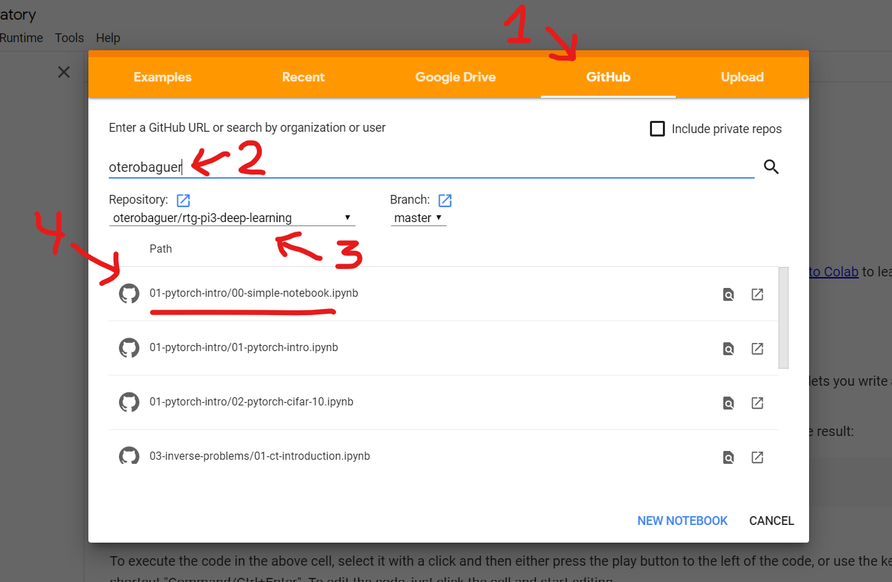

# Hands-on sessions of the RTG-$\pi^3$ Compact Course A3 on Deep Learning for Digital Pathology and Inverse Problems

Here you will find the course exercises as well as the solutions.
If you have any question or find any error please write me an email to otero@uni-bremen.de.

## Google Colab instructions

### 1) Create a google account (if you don't have one)

You need a google account for using Colab.

### 2) Open Google Colab

Go to [https://colab.research.google.com](https://colab.research.google.com).

### 3) Get the notebooks

Select the GITHUB tab (1) and type `oterobaguer` (2). Then select the `rtg-pi3-deep-learning` (3) repository (master branch) and try the `00-simple-notebook` (4) to verify that it works.

## Local installation instructions

### 1) Create folder for the exercises 
If you are using Git, then this happens automatically, otherwise download a .zip file with the content of the repository and uncompress it. Be careful that you don't loose your own solutions when updating the folder!

### 2) Install Python

For the exercises we are going to use Python (we recommend to use the Miniconda distribution).

The installer files for all platforms (Windows, Linux, Mac) can be found in:

[https://docs.conda.io/en/latest/miniconda.html](https://docs.conda.io/en/latest/miniconda.html)

Please download the appropiate installer and run it.

 - If your computer has a 64-bit operating system (most likely) select the *64-bit installer* for *Python 3.7*.

 - If your system has a 32-bit operating system (unlikely) you will need to install the *32-bit installer* for *Python 3.7*.
 
 - If you get asked if you want to add the Miniconda directory to the `PATH` select yes.
 
 
Confirm that you have successfully installed Miniconda by opening a console and typing `conda`. If an error appears then Conda was not added to the `PATH`. You have to search for the *Anaconda Promt* terminal and open it. Then you have to change the directory the terminal is pointing to, using for example `cd local_folder\local_folder2`, to the directory that contains the exercises.
 
### 3) Install required packages

1. Open a console on the folder where you have the repo and create a virtual environment by running `conda create --name dl_intro`.

2. Activate the environment with the command `conda activate dl_intro`.

3. The list of required packages is contained in the file [requirements.txt](/requirements.txt). Install all of them by running the command `conda install --file requirements.txt`.

4. Install `pytorch`. If you have a supported Nvidia GPU on our system run `conda install pytorch torchvision cudatoolkit=9.0 -c pytorch`. Otherwise just run `conda install pytorch torchvision -c pytorch`.

### 4) Run Jupyter Notebook
When everything is installed open a terminal on the exercises folder and run `jupyter notebook`.

### 6) Remarks
The jupter notebooks in the repository are designed to work in Google Colab, if you want to use them locally you might need to do some changes.
